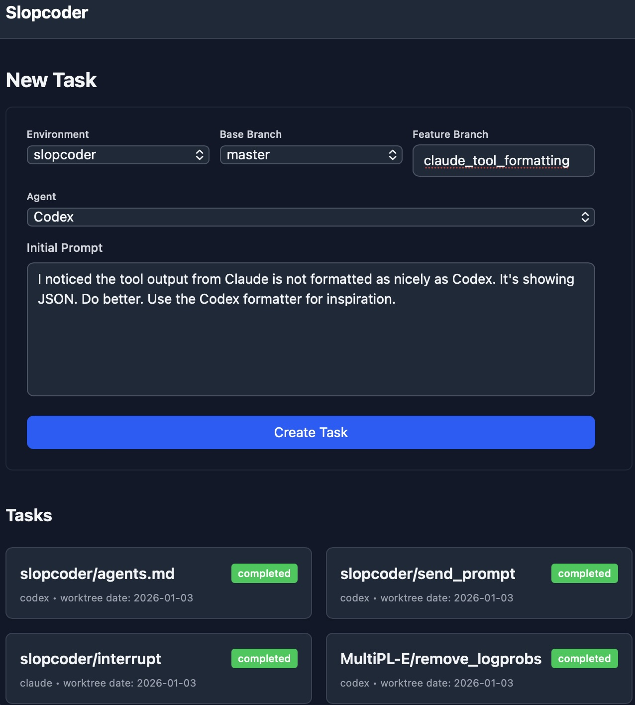

# Slopcoder

Slopcoder is a web-based frontend to coding agents that run on one or more
`slopagent` workers. You run one `slopcoder-server` coordinator (usually on
your desktop) and connect multiple agents (local or remote) over WebSocket.




## Building from Source

Slopcoder relies on TypeScript and Rust. The simplest way to build it from
source is to run `make all`.

## Using Slopcoder (Coordinator + Agents)

Slopcoder relies on git worktrees. If you don't know how to use them, you won't
be able to use Slopcoder.

Each `slopagent` has its own `environments.yaml` and manages repositories local
to that host. Environments are now configured as checked-out Git repository
directories, plus a shared directory for isolated worktrees.

Task metadata is stored under:
- `<worktrees_directory>/.slopcoder-state/<environment-slug>/tasks.yaml`
- `<worktrees_directory>/.slopcoder-state/<environment-slug>/task-<id>.jsonl`

When creating a task, you can choose:
- In-place task: run directly in the environment repository directory.
- Isolated task: create a new worktree and branch based on the environment's
  current branch; these are mergeable via the UI/API.

Create `environments.yaml` on each host where a `slopagent` runs:

```yaml
worktrees_directory: "/path/to/worktrees"
environments_root: "/path/to/env-root" # optional, defaults to ~/slop
environments:
  - "/scratch/arjun-nosudo/repos/nuprl/MultiPL-E"
  - "/path/to/another/checked-out/repo"
```

In the UI, "Create Environment" creates a new repository at
`<environments_root>/<name>` on the selected host and refreshes the list
immediately. `slopagent` also auto-discovers repositories under
`environments_root` (direct child repos and `<child>/main` or `<child>/master`)
without modifying `environments.yaml`.

Start the coordinator:

```bash
slopcoder-server --addr 127.0.0.1:8080
```

`slopcoder-server` uses two password scopes:
- `slopagent` connection password: always required. By default it is generated at startup and printed as `Slopagent password: ...`. You can override with `--agent-password` or `--agent-password-prompt`.
- Browser/UI password: optional. Enable with `--password` or `--password-prompt` (or keep disabled by default / force off with `--no-password`).

Start an agent (local or remote):

```bash
slopagent environments.yaml --server ws://127.0.0.1:8080
```

`slopagent` always prompts for the connection password in the terminal. You can
override the host label shown in the UI:

```bash
slopagent environments.yaml --server ws://127.0.0.1:8080 --name laptop-local
```

Agents can connect/disconnect dynamically; the UI updates hosts/environments
from currently connected agents.

## Securing Slopcoder

Slopcoder runs agents with all guardrails off, and in a shared execution
environment. Not only can agents on the same host see/modify each others' work,
they can also inspect local processes on that host.

I personally run Slopcoder as an unprivileged user that is not in sudoers. I
bind it to an IP address on a Wireguard VPN that I run, and configure the
firewall so that it is only accessible from the devices that I control. If you
don't understand what this paragraph means, you probably shouldn't use
Slopcoder.

## Slopcoder Prompts

The first few commits, by Claude Code, get most of Slopcoder in place. The
first was a transcription of something I dictated:


> The goal is to build a web application with a Rust backend, using Hyper and
> Warp, with Warp as the primary server framework. On the frontend, it would use
> TypeScript with a modern frontend framework—presumably React, although I would
> prefer something more modern or better-looking if appropriate.
> 
> I want to start with the backend. At a high level, the goal of the application
> is to provide an interface for launching and interacting with LLM agents
> running on the server.
> 
> There are a few core concepts to define, which together make up the application
> state.
> 
> First, there is the concept of an environment. The application tracks a set of
> preconfigured environments, defined in something like a YAML file. An
> environment has a name and a directory. Within that directory, there is a
> single subdirectory called bare, which contains a bare Git repository.
> Alongside it are several other working directories, implemented as Git
> worktrees based on that bare repository.
> 
> Next, there is the concept of a task. A task corresponds to one of these
> worktrees associated with an environment, along with the agent’s execution
> history.
> 
> Initially, the agent we will use is the OpenAI Codex CLI agent. The intended
> behavior of the web application is as follows.
> 
> When the web application starts, it serves an unauthenticated interface at a
> URL. Authentication is out of scope for now; this will run on a VPN.
> 
> When you open the web app, you see a list of active tasks and an option to
> create a new task. To create a new task, you select an environment, provide a
> name, select a branch from that environment, and supply an initial prompt. The
> selected branch determines the name of the subdirectory into which the task is
> checked out.
> 
> Once you start the task, the agent runs in that checkout directory in an
> unrestricted “YOLO” mode. Everything runs under a single unprivileged account,
> and data security is not a concern at this stage. The agent runs until it
> completes.
> 
> The agent can be launched in a mode where it streams its output as JSON. The
> server can forward this streaming output to the client so that it is displayed
> in real time.
> 
> When the agent finishes running, it produces a session ID—some hexadecimal or
> textual identifier. We need to associate this session ID with each task,
> because it allows us to resume a task later and append additional prompts to
> the existing session.
> 
> One appealing aspect of this design is that the core agent-management
> functionality should be unit-testable independently of the server and the
> frontend. The plan is to get that core logic working first, then integrate it
> into the server, and finally build the client.
> 
> For initial testing, we can create a few trivial tasks for an agent—for
> example, one task where the first prompt asks the agent to write a program that
> prints “Hello, world,” based on some repository, and a follow-up prompt that
> modifies it to print something else, like “Goodbye, world.”
> 
> Getting that workflow working should be sufficient for a first milestone.
> Later, we can extend the system with features such as interrupting a running
> agent.

And these were the followups:

1. you don't need a Codex API key. I am logged in to Codex from the CLI, aren't I?

2. yes

3. Yes.

4. I'd like you to bind the server to 0.0.0.0. Also, to the environment file
   add the directory /scratch/arjun-nosudo/repos/nuprl/MultiPL-E. But check
   that I set up that direcotry right.

5. On the UI, it shows "Loading environments" when I click Loading Tasks. But,
   no environments show up. On the console I see index-DNC6qUam.js:1 GET
   http://localhost:3000/api/environments net::ERR_BLOCKED_BY_CLIENT

6. The color scheme is unreadable in the new task dialog. black text on black
   background. make it adaptive to dark/light mode on the user's machine too.

7. great, add a .gitignore at the repo root and commit these changes with a detailed commit message

8. So, you're using a sqlite database. What is in it (schema)?

9. I want persistence now. But not exactly in a database. In each environment
   directory, create a file call tasks.yaml that has the information that you
   need for the tasks in that directory. On startup and when I try to continue
   a task, check to ensure that every task mentioned exists -- I may have
   removed the worktrees from the CLI concurrently.

10. This is not behaving as I expect. When I restart the server, the list of
    tasks disappear.

11. So I just ran git worktree remove -f ../main in the MultiPL-E/bare
    directory from the CLI. But, when I reload the running server, the task
    still appears. In this situation, you should rebuild tasks.yaml
